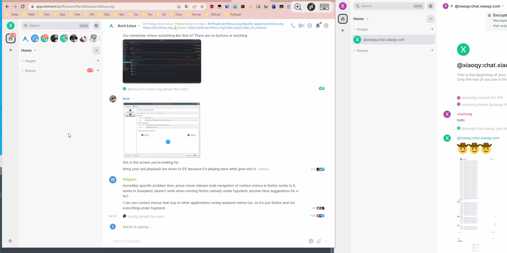

# 思远文文服务项目

> [!NOTE]
>
> [:house: 主页](https://www.xiaoqy.com) | ​[:heart: 捐赠](https://ko-fi.com/xiaoqy) ​ | ​[:e-mail: E-Mail​](mailto:ixiaoqy@outlook.com) | [:smiley: 关于我](https://about.xiaoqy.com)
>
> 
加载中...

> :book: 文章目录
[TOC]

<video src="./videos/xiaoww.com.mp4"></video>

## 思远文文网站开发项目

部分项目是采用的 `Vue3` + `Vite` + `TypeScript` + `JavaScript` + `React` + `Next.js`  + `Node.js` 等 `UI` 框架和组件等编程语言快速开发，部分静态站点由自托管平台运行，实现免维护，免受攻击，长期稳定运行，安全性极高。​

<a href="#top">TOP</a>

### 项目 1：思远文文的个人博客

:link: **网址：** [blog.xiaoww.com](https://blog.xiaoww.com) | [yublog.me](https://yublog.me)

:bar_chart: **状态：** **暂停服务，因资金原因**

:speech_balloon: **描述：** 个人分享，生活指南，购物指南，健康知识，直播知识，人生指南，建筑设计，建筑装修，家庭装修，旅行指南，美食食谱，心理健康，摄影指南，睡眠健康，职业规划，媒体编辑，写作规范，排版规范，笔记知识，行为管理，学术文献，创业知识，插画设计，法律知识，宠物护理，阅读书籍，手绘艺术，社会经历，美妆护理，工作简历，形象形体，产品评测，交通知识，文化知识，食品安全，语言交流，时间管理，效率管理，养生知识。

<a href="#top">TOP</a>

### 项目 2：思远文文的技术博客

:link: **网址：** [geek.xiaoww.com](https://geek.xiaoww.com) | [yugeek.me](https://yugeek.me)

:bar_chart: **状态：** **暂停服务，因资金原因**

:speech_balloon: **描述：** 软件编程，软件开发，软件编译，网站开发，电子开发，硬件开发，自动化，桌面运维，系统优化，软件汇编，密码破解，视频编辑，音频编辑，网络安全，服务器，通讯系统，广播系统，应用容器，负载均衡，高可用，动画编程，代码压缩，加密解密，数据备份，数据恢复，编码解码，接口测试，网络测试，语言模型，人工智能，工业技术，电子维修，物联网，音乐编程，压力测试，逆向分析，颜色色卡，芯片烧录，产品渲染，远程控制，硬件 DIY，3D 打印，无线电，模型设计，建筑设计，平面设计，虚拟化，模拟器，微观生物，电池电源，传感器，数据存储，硬件刷机。

<a href="#top">TOP</a>

### 项目 3：思远文文的知识百科

(概念图仅供参考)

:link: **网址：** [wiki.xiaoww.com](https://wiki.xiaoww.com) | [knowledge.xiaoww.com](https://knowledge.xiaoww.com)

:bar_chart: **状态：** **未开发，因资金原因**

:speech_balloon: **描述：** 编程思想，学习思想，人生知识，健康饮食，购物评价，网购攻略，智能家居，医疗药品，生活窍门，育儿纪录，视力保护，照顾建议，喂养技巧，页面开发，网站部署，部署工具，必备应用，工具笔记，读书方法，读书笔记，思维方式，自我认知，社会认知，市场营销，社会经济，健身计划，仪式清单，自我监控，时间管理，日常习惯，美容仪器，直播手册，星座知识，股票行情，求生知识，租房流程，优质播客，美食烹饪，清洗知识，网络知识，个人形象，个人提升，人脉关系，爱情婚姻，法律知识，电影学习，音乐学习，书法知识，乐器知识。

<a href="#top">TOP</a>

### 项目 4：思远文文的直播

:link: **网址：** [live.xiaoww.com](https://live.xiaoww.com) | [livestream.xiaoww.com](https://livestream.xiaoqy.com) / [xiaoww.tv](https://xiaoqy.tv)

:bar_chart: **状态：** **服务试运行**

:speech_balloon: **描述：**

很早之前，我就有了开直播的想法。网络直播提供了一个即时互动的平台，让观众能够实时与主播交流，提出问题、分享意见。这种互动性增强了用户的参与感和体验，使内容更具吸引力。同时也可以和观众一起互动交流和观看影片。

通过直播，主播可以与观众互动交流，一起观看影片。此外，还可以实现多平台同步直播（联播多播），扩大受众群体。这一项目目前处于试运行阶段，正在进行各项测试，包括应用压力测试、网络连通稳定性、流媒体编解码负载、实时画面渲染优化、网络推拉流优化、视频采样率优化、全球网络内容分发、网络转播优化、反向代理调度、缓存机制优化等。

直播相比点播的最大优势在于，它能够减少单点对多点的回源访问压力，通过实时内容分发优化网络资源的使用。
内容交付网络 (CDN) 是一组分布在一个区域内或全球各地的服务器，它们协同工作以加快 Web 上的内容交付。CDN 中的服务器会临时存储（或缓存）网页内容。无论观众身处何地，都能通过 CDN 节点获得流畅的观看体验，将内容分发到多个节点，CDN 能有效分散负载，减轻源服务器的负载压力，还能超低延迟访问。

对于我们所使用的各种软件播放器和网页播放器，它们在底层编码解码过程中，都是基于定制的 FFmpeg 和 FFplay 核心技术。这些播放器通过包装不同的用户界面，提供用户友好的操作体验，而实际的音视频处理则由这些底层技术来完成。

直播实现的核心原理是基于底层的 FFmpeg 和 FFplay 技术来进行音视频的编解码。通过这些工具，我们可以实现音视频的推拉流。但如果观众直接从服务器拉流观看，可能会导致服务器的超负荷运转。在这种情况下，使用 CDN（内容分发网络，也称内容交付网络）就显得尤为重要。

我的直播计划是 7 X 24 小时不间断进行，期待您的参与。如果您有有趣的想法和话题，欢迎分享。
网络直播涵盖了广泛的内容类型，包括音乐、电影、教育、科技、旅游、绘画、演讲，也包括知识学习、户外旅游、个人提升等。不同兴趣的观众可以找到符合自己喜好的直播内容，满足多样化的需求等。

大平台同步直播（国内）：
斗鱼：https://www.douyu.com/xiaoqy
虎牙：https://www.huya.com/xiaoqy

<a href="#top">TOP</a>

### 项目 5：思远文文的商店

:link: **网址：** [shop.xiaoww.com](https://shop.xiaoww.com) | [store.xiaoww.com](https://store.xiaoww.com) / [buy.xiaoww.com](https://buy.xiaoww.com)

:bar_chart: **状态：** **未开发，因资金原因和时间成本原因**

:speech_balloon: **描述：** 

<a href="#top">TOP</a>

### 项目 6：思远文文的相册

(概念图仅供参考)

:link: **网址：** [photos.xiaoww.com](https://photos.xiaoww.com) | [photo.xiaoww.com](https://photo.xiaoww.com) / [pictures.xiaoww.com](https://pictures.xiaoww.com) / [picture.xiaoww.com](https://picture.xiaoww.com) / [albums.xiaoww.com](https://albums.xiaoww.com) / [album.xiaoww.com](https://album.xiaoww.com) / [images.xiaoww.com](https://images.xiaoww.com) / [image.xiaoww.com](https://image.xiaoqy.com)

:bar_chart: **状态：** **未开发，因资金原因**

:speech_balloon: **描述：** 

<a href="#top">TOP</a>

### 项目 7：思远文文的音乐

:link: **网址：** [music.xiaoww.com](https://music.xiaoqy.com)

:bar_chart: **状态：** **服务正常运行**

:speech_balloon: **描述：** 

<a href="#top">TOP</a>

### 项目 8：思远文文的社区

(概念图仅供参考)

:link: **网址：** [social.xiaoww.com](https://social.xiaoww.com) | [community.xiaoww.com](https://community.xiaoww.com)

:bar_chart: **状态：** **未开发，因资金原因和时间成本原因**

:speech_balloon: **描述：** 

<a href="#top">TOP</a>

### 项目 9：思远文文的实验室

:link: **网址：** [xiaoww.com/experiment](https://xiaoww.com/experiment) | [xiaoww.com/lab](https://xiaoww.com/lab)

:bar_chart: **状态：** **未开发**

:speech_balloon: **描述：** 

<a href="#top">TOP</a>

### 项目 10：文文云音乐

:link: **网址：** [cmusic.xiaoww.com](https://cmusic.xiaoww.com) | [cloudmusic.xiaoww.com](https://cloudmusic.xiaoww.com)

:bar_chart: **状态：** **服务正常运行**

:speech_balloon: **描述：** 

<a href="#top">TOP</a>

### 项目 11：文文书屋

:link: **网址：** [books.xiaoww.com](https://books.xiaoww.com) | [book.xiaoww.com](https://book.xiaoww.com)

:bar_chart: **状态：** **未开发，因资金原因和时间成本原因**

:speech_balloon: **描述：** 

<a href="#top">TOP</a>

### 项目 12：文文画板

:link: **网址：** [draw.xiaoww.com](https://draw.xiaoww.com) | [paint.xiaoww.com](https://paint.xiaoww.com)

:bar_chart: **状态：** **服务正常运行**

:speech_balloon: **描述：** 

<a href="#top">TOP</a>

### 项目 13：文文思维导图

:link: **网址：** [mindmap.xiaoww.com](https://mindmap.xiaoww.com)

:bar_chart: **状态：** **服务正常运行**

:speech_balloon: **描述：** 

<a href="#top">TOP</a>

### 项目 14：文文今日热榜

:link: **网址：** [hot.xiaoww.com](https://hot.xiaoww.com) | [news.xiaoww.com](https://news.xiaoww.com) / [today.xiaoww.com](https://today.xiaoww.com)

:bar_chart: **状态：** **服务正常运行**

:speech_balloon: **描述：** 

<a href="#top">TOP</a>

### 项目 15：文文计算器

:link: **网址：** [calc.xiaoww.com](https://calc.xiaoww.com) | [calculator.xiaoww.com](https://calculator.xiaoww.com)

:bar_chart: **状态：** **服务正常运行**

:speech_balloon: **描述：** 

<a href="#top">TOP</a>

### 项目 16：文文 AI 聊天

:link: **网址：** [aichat.xiaoww.com](https://aichat.xiaoww.com) | [gpt.xiaoww.com](https://gpt.xiaoww.com)

:bar_chart: **状态：** **服务正常运行**

:speech_balloon: **描述：** 

<a href="#top">TOP</a>

### 项目 17：完美导航网

:link: **网址：** [wmnav.com](https://wmnav.com) ( 原：[24ta.com](https://24ta.com) )

:bar_chart: **状态：** **暂停服务，因资金原因**

:speech_balloon: **描述：** 

<a href="#top">TOP</a>

### 项目 18：爱好盘

:link: **网址：** [ihpan.com](https://ihpan.com)

:bar_chart: **状态：** **暂停服务，因资金原因**

:speech_balloon: **描述：** 

<a href="#top">TOP</a>

### 项目 19：文文单词打字机

:link: **网址：** [qwerty.xiaoww.com](https://qwerty.xiaoww.com)

:bar_chart: **状态：** **服务正常运行**

:speech_balloon: **描述：** 文文单词打字机：通过打字练习方式来实现肌肉记忆，让大脑更省力。学习时间更碎片化，更灵活！陪你从小到大，不分年龄，人人皆可学。

软件设计的目标群体为以英语作为主要工作语言的键盘工作者。部分人会出现输入母语时的打字速度快于英语的情况，因为多年的母语输入练就了非常坚固的肌肉记忆，而英语输入的肌肉记忆相对较弱，易出现输入英语时“提笔忘字”的现象。

同时为了巩固英语技能，也需要持续的背诵单词，本软件将英语单词的记忆与英语键盘输入的肌肉记忆的锻炼相结合，可以在背诵单词的同时巩固肌肉记忆。

为了避免造成错误的肌肉记忆，设计上如果用户单词输入错误则需要重新输入单词，尽可能确保用户维持正确的肌肉记忆。

肌肉记忆是内隐记忆的一种，它指的是人在一段时间内重复做出一个动作后，大脑就会记住这一动作，最终人能在不用多想的情况下就能做出这一动作。许多日常活动中都有肌肉记忆的身影，例如骑自行车、驾驶机动车、玩球类运动、游泳、键盘打字、输入密码、演奏乐器、打扑克、表演武术和跳舞等。

软件也对需要机考英语的人群有一定的帮助。

背单词：

可以选择记忆或默写单词，提供了音标显示、发音功能（均可选美音、英音）、错误统计

错词本：

默写单词时输入错误会自动添加到错词本，以便后续复习。

默写模式：

在用户完成一个章节的练习后，如果有错误词，那么会重复练习错误词，直到没有错误词为止。完成之后弹出选项可选择默写本章、重复本章、下一章

词库：

内置了常用的大学英语、新概念英语、考研英语、雅思托福、多邻国、专业四级英语、专业八级英语，也有程序员常见英语单词以及多种编程语言 API 等词库。 尽可能满足大部分用户对背单词的需求。

<a href="#top">TOP</a>

### 项目 20：生命周期管理

:link: **网址：** [services.xiaoww.com/lifecycle](https://services.xiaoww.com/lifecycle)

:bar_chart: **状态：** **未开发**

:speech_balloon: **描述：** 

<a href="#top">TOP</a>

### 项目 21：文文交互审计系统

(概念图仅供参考)

:link: **网址：** [developer.xiaoww.com/ternimals](https://developer.xiaoww.com/ternimals)

:bar_chart: **状态：** **未开发**

:speech_balloon: **描述：** 

<a href="#top">TOP</a>

### 项目 22：资产管理

:link: **网址：** [services.xiaoww.com/finance](https://services.xiaoww.com/finance)

:bar_chart: **状态：** **未开发**

:speech_balloon: **描述：** 

<a href="#top">TOP</a>

### 项目 23：3D 查看器

(概念图仅供参考)

:link: **网址：** [apps.xiaoww.com/3dviewer](https://apps.xiaoww.com/3dviewer)

:bar_chart: **状态：** **未开发**

:speech_balloon: **描述：** 

<a href="#top">TOP</a>

### 项目 24：光学射线模拟器

(概念图仅供参考)

:link: **网址：** [apps.xiaoww.com/raysimulator](https://apps.xiaoww.com/raysimulator)

:bar_chart: **状态：** **未开发**

:speech_balloon: **描述：** 

<a href="#top">TOP</a>

### 项目 25：爱好猫科技

:link: **网址：** [ihmao.com](https://ihmao.com)

:bar_chart: **状态：** **未开发，因资金原因和时间成本原因**

:speech_balloon: **描述：** 

### 项目 26：爱好猫社区

(概念图仅供参考)

:link: **网址：** [forum.ihmao.com](https://forum.ihmao.com) | [social.xiaoww.com](https://social.xiaoww.com) / [community.ihmao.com](https://community.ihmao.com) / [bbs.ihmao.com](https://bbs.ihmao.com)

:bar_chart: **状态：** **未开发，因资金原因和时间成本原因**

:speech_balloon: **描述：** 

<a href="#top">TOP</a>

### 项目 27：宝库猫应用

:link: **网址：** [bkmao.com](https://bkmao.com)

:bar_chart: **状态：** **未开发，因资金原因和时间成本原因**

:speech_balloon: **描述：** 

<a href="#top">TOP</a>

### 项目 28：代码编辑器

:link: **网址：** [code.xiaoww.com](https://code.xiaoww.com) | [editor.xiaoww.com](https://editor.xiaoww.com)

:bar_chart: **状态：** **暂停服务，因资金原因**

:speech_balloon: **描述：** 

<a href="#top">TOP</a>

### 项目 29：文文安全聊天

:link: **网址：** [chat.xiaoqy.com](https://chat.xiaoqy.com) | [message.xiaoqy.com](https://message.xiaoqy.com) / [talk.xiaoqy.com](https://talk.xiaoqy.com)

:bar_chart: **状态：** **服务正常运行**

:speech_balloon: **描述：** 文文安全聊天，这是现在最好的聊天服务，也是最安全的聊天服务，没有之一！支持多个客户端： `Windows/Android/IOS/Web` 等

支持语音通话，视频通话，发文字语音，发表情，发视频图片，投票，位置等，是一款成熟稳定的社交平台。

在航天领域，互联网企业，网络安全领域广泛使用安全的加密软件。
首先文文安全聊天是一个去中心化的聊天服务，实现了端对端的加密，这意味着不仅其他人无法查看你的聊天内容，哪怕你更换了一个终端，你也需要私钥才能够查看你的聊天记录。

这是终极的隐私保护方案，因为一旦你丢掉了这个密钥，这些内容就相当于被销毁了。

底层服务基于 `Matrix` 如果你能够访问到 `Matrix` 的服务器那么就可以直接使用 `Matrix` 的主聊天服务。

文文安全聊天未开发网页服务，目前仅只能使用客户端，未来将开发在线网页服务。

您仍可以使用第三方在线网页平台 `app.element.io` 和 `fluffychat.im/web` 来连接到 `chat.xiaoqy.com` 服务器来使用文文安全聊天服务平台。

<a href="#top">TOP</a>

### 项目 30：文文文件快传

:link: **网址：** [transfer.xiaoww.com](https://transfer.xiaoww.com) | [files.xiaoww.com](https://files.xiaoww.com)

:bar_chart: **状态：** **暂停服务，将进行二次开发**

:speech_balloon: **描述：** 

<a href="#top">TOP</a>

### 项目 31：文文 Markdown 编辑器

:link: **网址：** [md.xiaoww.com](https://md.xiaoww.com) | [markdown.xiaoww.com](https://markdown.xiaoww.com)

:bar_chart: **状态：** **未开发**

:speech_balloon: **描述：** 

<a href="#top">TOP</a>

### 项目 32：文文聚合阅读器

:link: **网址：** [rss.xiaoww.com](https://rss.xiaoww.com)

:bar_chart: **状态：** **未开发**

:speech_balloon: **描述：** 

<a href="#top">TOP</a>

## 思远文文软件开发项目

<a href="#top">TOP</a>

### 文文时间计算器

<a href="#top">TOP</a>

### 文文身份生成器

<a href="#top">TOP</a>

### 文文随机数生成器

<a href="#top">TOP</a>

## 思远文文电子开发项目

未来开发电子项目清单（思远文文电子硬件创客计划）
电源和电池类：
220v 高频纯正弦波逆变器移动电源（120ah 宁德时代磷酸铁锂大单体 x16 + 极空电池保护板 + 智能显示屏 + 不锈钢铝合金电池箱等）
太阳能单晶硅电池板 18v 200w（配备mppt太阳能控制器和220v工频纯正弦波逆变器和300ah 宁德时代磷酸铁锂电池组家用太阳能发电储能方案）
多功能可调电源（可调的恒压恒流电源，具有电路逆向保护功能）
多功能电压表（实时远端监控电费状况）
智能继电器电源开关
120ah pd 无线快充充电宝（将选用高倍率46160或46650锂电池，带显示屏亚克力板，220v和USB快充以及DC5-24v多口输出，内置COB高亮灯珠，无线充电模块）
多功能快充充电器
UPS 不间断电源（服务器应急供电方案）

电磁线圈和高压装置类：
高压包点火器（低压高电流电弧点火器）
高压发生器（马克思发生器）
特斯拉发生器（单电线雷电模拟装置）
法拉电容2.7v3000F液晶显示屏脉冲点焊机
脉冲电磁炮
离子飘升机（通过高频电流产生静电驱动力）
大功率电蚊机
电磁加热器（以电磁炉原理，感应线圈实现瞬间加热，熔炼铁皮铝合金金属等）

显示和照明类：
迷你便携显示器充电宝（在屏库网采购手机或平板屏幕，加聚合物软包电芯，自行设计原理图和电路开发电路板，组成一台便携多输入显示器，同时也是一台输出充电宝，HDMI也可自身供电）
电子墨水屏桌面时钟（最佳省电桌面天气时钟方案）
大屏智能音箱（内置安卓开发版，带有蓝牙投屏和电台播客软件）
LED 光立方
LED 立方体镜子
LED 音乐频率分析器
迷你手电筒（1000mah聚合物软包电池，3v COB LED 高亮灯板，只要灯珠多，说不定还能反向充电呢）
手电筒（32700 锂电池 + 12v COB LED 高亮灯板，可对焦光控，SOS 功能等）
安卓广告工控机（使用 J1900 主机打照廉价的广告展示信息机）

音响和声波类：
可调恒压恒流电源
可充电式电烙铁
载物运输无人机（四轴高速电机驱动，高清拍摄，轨道识别，离线返航，人物跟随，OPENCV 人物识别，智能避障等）
压电陶瓷片（用于模拟鸣笛高音喇叭）
超声波清洗机（轻松清洗顽固油性污渍）
声波分析仪（分析声压分贝与声频赫兹）
超声波加湿器（使用雾化压电陶瓷片加 Arduino 驱动信号发生器，简单做一个家用雾化加湿器）
骨传导共振音响（使任何介质物体都能传播声音，包括墙壁混泥土钢板）

电机和风扇类：
减速发电机
12v 风扇空调
全息风扇
高速电磨机
12v 10万转涵道风扇（打造比戴森电吹风机更强劲的手持风扇）
12v 台达4056服务器风扇
16v Fms 70涵道飞行器风扇（高达1000g推力）

无线电射频类：
调频收音机
无线电转发器（能够与卫星无线电波频率通信）

高精度数控打印类：
绘图写字机器人（采用Arduino + cnc shield控制驱动板，所有零件都可纯手工组装，模拟人工写作，填写表格，绘画等）
3D材料打印机（abs，pla，petg主流材料打印任何塑料外壳，玩具积木零件）
激光镭雕机（低速低功耗激光只对木质材料，塑料进行烧刻）
CNC雕刻机（对一定强度金属，铝合金，木头，异性3D实现雕刻切割）

电子仪器和驱动器类：
DDS信号发生器
红外热成像
智能示波器
自平衡车（利用陀螺仪实现自动平衡）
辐射探测器
心率检测仪
金属探测仪（利用电磁线圈感应磁场，金属，喇叭，风扇，磁铁，电机）

物联网和传感器类：
NFC智能标签墨水屏卡片（具有读写模拟NFC RFID加密卡片功能）
无线充电水泵
温湿度环境监测传感器
指尖视觉控制器
自平衡机器人
遥控潜水艇
桌面信息牌
物联网桌面显示器时钟（采用ESP32开发，具有时钟闹钟，天气预报，网络信息同步，家电物联等功能）
物联网RGB灯带
物联网红外线万能遥控（比家用任何红外线遥控器更强，四周多灯珠无死角控制任何家电）

<a href="#top">TOP</a>

## 思远文文作品创作项目

<a href="#top">TOP</a>

## 思远文文设备运维项目

<a href="#top">TOP</a>

## 个人长短途跑腿万能帮

个人长短途跑腿万能帮服务，你动嘴，我跑腿！璧山区 | 大学城 | 九龙坡区

帮取送、帮买、帮排队，万能帮万事帮！

代取送：文件、礼品、快递包裹、鲜花、蛋糕、酒水、手机、电脑、身份证、公交卡、银行卡、钥匙、箱包、五金机电；

代购：餐食、美食、零食、酒水、奶制品、袋装水、建材、生活用品、药品、票务；

代缴：话费、水电气费；

代办：手机业务、宽带业务、陪伴照顾、接送小孩、做图修图、复印打印、文档表格、数据统计；

代找：找地点、找工作、看房子、看车子；

代办事：搬东西、做清洁、遛宠物；

代拍摄：观光旅游、现场活动、风景建筑、门店商铺、商品物品；

代托管：快递包裹、行李物品、物业品；

代排队：挂号等待、看管物品；

保障服务：全程可定位跟踪，全程可语音视频、全程取送拍照留证。

与我沟通时请说明时间、地点、任务内容，部分服务按需收费。

需要提前找我沟通，价格好协商，时间可定，长期服务更方便。

两轮车配送，不接受大件物品、超重物品和超长物品。

贵重物品和紧急需求建议走其它平台。

服务地区：

璧山区（常驻起点）：双星大道、聚金大道、东林大道、黛山大道、瀛嘉大道、永嘉大道、璧青路、中央大街、大润发、重百商场、梦园广场、大成广场、一天门、24 队车站、北门车站、湿地公园、秀湖公园、玉泉湖公园、地铁站、高铁站、云巴站

沙坪坝区：尖顶坡、大学城、陈家桥、微电园、赖家桥、曾家、西永、香炉山、歌乐山、三峡广场等

九龙坡区：杨家坪、谢家湾、石坪桥、重庆动物园、直港大道、云龙大道、火炬大道、山姆会员商店等

江北区：观音桥、野水沟、未来国际、朗晴广场、红旗河沟、龙湖新壹街等

渝北区：碧津公园、江北机场、空港广场、渝北广电等

南岸区：南坪、工贸、南坪万达广场、南坪会展中心、重庆汽车站等

主城区：大渡口区 | 渝中区 | 巴南区等

信息服务正在完善，尽情期待！

<a href="#top">TOP</a>

## 思远文文媒体管理项目

<a href="#top">TOP</a>

## 思远文文产品设计项目

<a href="#top">TOP</a>